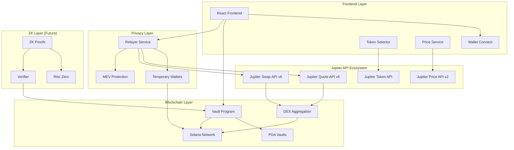
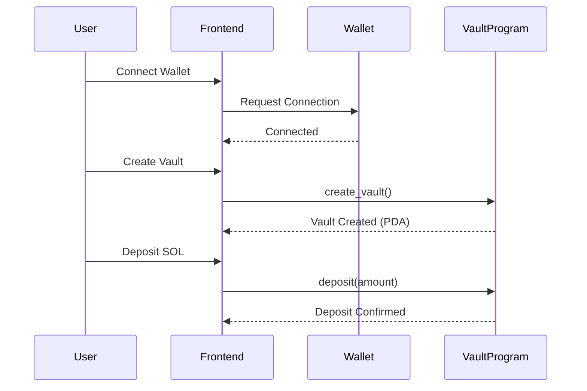
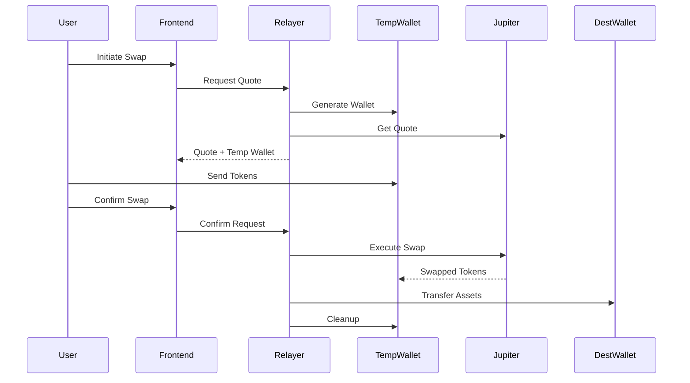

# 🔐 Miko Vault - Privacy-Focused DeFi Platform

A comprehensive decentralized finance platform built on Solana that enables private token swaps and secure vault management through innovative temporary wallet technology and zero-knowledge proof integration.

## 🎯 Project Overview

Miko Vault revolutionizes DeFi privacy by combining secure on-chain vault management with privacy-enhanced token swapping. The platform uses temporary wallets to obscure transaction origins while maintaining full decentralization and user control.

## 🎬 Demo & Deployment Status

### 📺 Live Demo
Experience Miko Vault in action with our comprehensive demo video:
**[🎥 Watch Demo Walkthrough](https://www.loom.com/share/b94207a9b5f24a7d962d48fa36d2333b?sid=46aad24f-bce5-4f30-8b15-8e8c072627a3)**

### 🌐 Current Deployment
**Network**: Solana Devnet  
**Status**: Fully Functional Development Environment

> **Note**: The current deployment is running on Solana Devnet to ensure optimal development and testing experience. While we maintain production-ready code standards, mainnet deployment requires additional infrastructure investment (approximately 1.5 SOL for deployment costs and initial liquidity). The devnet environment provides full functionality demonstration and allows users to explore all features without mainnet fees.

### 🌟 Key Features

- **🏦 Personal Vaults**: Secure, PDA-based vault system for fund management
- **🔄 Private Swaps**: Transaction origin obscuration through temporary wallets
- **🛡️ Zero-Knowledge Ready**: Foundation for ZK proof integration
- **⚡ Jupiter Integration**: Access of all tokens with optimal routing via Jupiter v6 API
- **📱 Modern UI**: Responsive React frontend with seamless wallet integration
- **🔒 MEV Protection**: Optional MEV-resistant transaction execution
- **🧹 Auto-Cleanup**: Automatic cleanup of temporary wallets and sensitive data

## ⚡ Jupiter API Integration

Miko Vault leverages Jupiter's comprehensive API ecosystem to provide optimal swap rates and extensive token support across both backend and frontend components.

### 🔧 Relayer Integration (`/relayer`)

**Jupiter v6 API** (`https://quote-api.jup.ag/v6`)
- **Quote Endpoint** (`/quote`): Generates optimal swap routes with real-time pricing
  - Supports 500+ tokens with deep liquidity analysis
  - Advanced slippage calculation and price impact assessment
  - MEV-resistant routing with restricted intermediate tokens
  - Dynamic compute unit optimization for gas efficiency

- **Swap Endpoint** (`/swap`): Creates executable transaction data
  - Generates signed transactions ready for blockchain execution
  - Implements priority fee optimization for fast confirmation
  - Supports wrapped/unwrapped SOL handling automatically
  - Includes MEV protection through Jito bundle integration

**Key Features:**
```javascript
// Example quote request with MEV protection
{
  inputMint: "So11111111111111111111111111111111111111112", // SOL
  outputMint: "EPjFWdd5AufqSSqeM2qN1xzybapC8G4wEGGkZwyTDt1v", // USDC
  amount: "1000000", // 0.001 SOL in lamports
  slippageBps: 50, // 0.5% slippage tolerance
  restrictIntermediateTokens: true, // MEV protection
  excludeDexes: "Aldrin,Crema" // Exclude problematic DEXs
}
```

### 🎨 Frontend Integration (`/frontend`)

**Jupiter Token API** (`https://lite-api.jup.ag/tokens/v1`)
- **Token Discovery**: Complete token registry with metadata
- **Symbol & Name Lookup**: Comprehensive token information
- **Logo URI Management**: Official token imagery and branding
- **Verification Status**: Trusted token identification
- **Volume Data**: 24h trading volume for popularity ranking

**Jupiter Price API** (`https://api.jup.ag/price/v2`)
- **Real-time Pricing**: Live token price feeds
- **Multi-token Support**: Batch price requests for efficiency
- **USD Conversions**: Accurate fiat value calculations
- **Market Data**: Price changes and trading metrics

**Implementation Example:**
```typescript
// Token search with price integration
const searchResults = await tokenService.searchTokens("USDC", 20);
// Returns tokens with live prices and metadata

// Real-time price monitoring
const prices = await jupiterPriceAPI.getPrices([
  "So11111111111111111111111111111111111111112", // SOL
  "EPjFWdd5AufqSSqeM2qN1xzybapC8G4wEGGkZwyTDt1v"  // USDC
]);
```

### 🛡️ Advanced Jupiter Features

**MEV Protection Integration:**
- **Route Optimization**: Selects MEV-resistant liquidity sources
- **Slippage Management**: Dynamic slippage based on market conditions
- **Priority Fee Calculation**: Automated fee optimization for fast execution
- **Bundle Support**: Jito integration for transaction protection

**Performance Optimizations:**
- **Connection Pooling**: Efficient API request management
- **Response Caching**: 5-minute cache for token data and prices
- **Batch Requests**: Minimizes API calls for better performance
- **Retry Logic**: Robust error handling with exponential backoff

**Supported Trading Pairs:**
- ✅ SOL ↔ All Major Stablecoins (USDC, USDT)
- ✅ SOL ↔ Popular Tokens (RAY, BONK, JTO, WEN, etc.)
- ✅ Any Jupiter-supported token pair combinations
- ✅ Cross-DEX routing for optimal rates

## 🏗️ System Architecture



### 🔧 Three-Tier Architecture

#### 1. **Smart Contracts** (`/contracts`)
- **Framework**: Anchor (Solana)
- **Program ID**: `2aur2Det6v69t2iyPNSuZCBkMrU3SZv1EHCHfDS9yjwK`
- **Features**: PDA-based vaults, secure SOL handling, balance tracking
- **Security**: Access control, overflow protection, deterministic addresses

#### 2. **Frontend Application** (`/frontend`)
- **Framework**: React 18 + TypeScript + Vite
- **UI Library**: shadcn/ui with Tailwind CSS
- **Features**: Wallet integration, real-time updates, token search
- **Components**: 30+ reusable UI components, responsive design

#### 3. **Relayer Service** (`/relayer`)
- **Framework**: Node.js + Express
- **Features**: Temporary wallets, Jupiter integration, MEV protection
- **Security**: Encrypted storage, automatic cleanup, rate limiting
- **API**: RESTful with Swagger documentation

## 🚀 Quick Start

### Prerequisites

```bash
# Install Solana CLI
sh -c "$(curl -sSfL https://release.solana.com/v1.18.0/install)"

# Install Anchor
npm install -g @coral-xyz/anchor-cli

# Install Node.js 18+
# Visit: https://nodejs.org/

# Install Rust
curl --proto '=https' --tlsv1.2 -sSf https://sh.rustup.rs | sh
```

### 🏗️ Setup Instructions

#### 1. Clone Repository
```bash
git clone <repository-url>
cd miko
```

#### 2. Smart Contracts Setup
```bash
cd contracts

# Install dependencies
yarn install

# Build program
anchor build

# Run tests
anchor test

# Deploy to devnet
anchor deploy --provider.cluster devnet
```

#### 3. Frontend Setup
```bash
cd frontend

# Install dependencies
npm install

# Set up environment
cp .env.example .env
# Configure VITE_SOLANA_RPC_URL and VITE_RELAYER_URL

# Start development server
npm run dev
```

#### 4. Relayer Setup
```bash
cd relayer

# Install dependencies
npm install

# Set up environment
cp .env.example .env
# Configure Solana RPC, Jupiter settings, etc.

# Start relayer service
npm start

# Access API docs
open http://localhost:3001/api-docs
```

#### 5. ZK Coprocessor Setup (Optional)
```bash
cd zk-coprocessor

# Install Risc Zero
curl -L https://risczero.com/install | bash
rzup

# Build guest program
cargo build --release

# Run host program
cargo run --release
```

## 🔄 System Flow

### 1. Vault Operations


### 2. Private Swap Flow


## 📁 Project Structure

```
miko/
├── contracts/                  # Solana smart contracts
│   ├── programs/vault/         # Main vault program
│   ├── tests/                  # Anchor test suite
│   └── Anchor.toml            # Anchor configuration
├── frontend/                   # React application
│   ├── src/components/         # UI components
│   ├── src/contexts/          # React contexts
│   ├── src/hooks/             # Custom hooks
│   ├── src/lib/               # Utilities and services
│   └── src/pages/             # Route components
├── relayer/                    # Node.js relayer service
│   ├── src/routes/            # API endpoints
│   ├── src/services/          # Core services
│   ├── example/               # Test examples
│   └── docs/                  # Service documentation
├── zk-coprocessor/            # Zero-knowledge components
│   ├── guest/                 # Risc Zero guest program
│   ├── host/                  # Host application
│   └── README.md              # ZK setup guide
├── backend/                    # Additional backend services
├── scripts/                    # Deployment scripts
├── docs/                       # Project documentation
└── README.md                  # This file
```

## 🔧 Core Components Deep Dive

### Smart Contract Architecture

**Vault Program Features:**
- **PDA Derivation**: `[user_public_key, "vault"]`
- **Instructions**: `create_vault`, `deposit`, `withdraw`
- **Security**: Overflow checks, access control, balance validation
- **Storage**: Minimal on-chain data with efficient account structure

```rust
#[account]
pub struct VaultAccount {
    pub balance: u64,  // Tracked balance in lamports
}

#[derive(Accounts)]
pub struct CreateVault<'info> {
    #[account(
        init,
        payer = user,
        space = 8 + 8,  // Discriminator + balance
        seeds = [user.key().as_ref(), b"vault"],
        bump
    )]
    pub vault: Account<'info, VaultAccount>,
    // ... other accounts
}
```

### Frontend Architecture

**Component Hierarchy:**
- **VaultInterface**: Main dashboard with step navigation
- **TokenSelector**: Advanced token search with Jupiter integration
- **SwapForm**: Multi-step swap interface with validation
- **WalletConnect**: Multi-wallet Solana integration
- **UI Components**: 30+ shadcn/ui components

**State Management:**
- **VaultContext**: Vault operations and balance tracking
- **WalletContext**: Wallet connection and transaction state
- **Custom Hooks**: Token search, mobile detection, toast notifications

### Relayer Service Architecture

**Core Services:**
- **JupiterService**: Swap quote generation and execution
- **WalletService**: Temporary wallet management and cleanup
- **ConfirmService**: Swap confirmation and asset transfer

**API Endpoints:**
```typescript
POST /api/swap/quote      # Get swap quote with temp wallet
POST /api/swap/confirm    # Execute swap and transfer assets
GET  /health             # Service health check
```

**Security Features:**
- AES-256 encryption for stored keypairs
- Automatic wallet cleanup (5-minute TTL)
- Comprehensive input validation
- Rate limiting and DDoS protection

## 🛡️ Security Model

### Vault Security
- **PDA Access Control**: Only vault owners can operate
- **Balance Validation**: Prevents overdrafts and unauthorized transfers
- **Deterministic Addresses**: Consistent vault addresses across sessions
- **Overflow Protection**: Safe arithmetic operations

### Relayer Security
- **Temporary Wallets**: Ephemeral keypairs for each swap
- **Encrypted Storage**: AES-256 encryption with automatic cleanup
- **No Persistent Storage**: User funds never stored permanently
- **MEV Protection**: Optional Jito bundle integration

### Transaction Security
- **Slippage Protection**: Configurable maximum slippage tolerance
- **Priority Fees**: Dynamic fee calculation for fast confirmation
- **Transaction Monitoring**: Real-time status tracking
- **Error Recovery**: Graceful handling of failed transactions

## 🧪 Testing Strategy

### Smart Contract Tests
```bash
cd contracts
anchor test                    # Full test suite
anchor test --skip-deploy     # Skip deployment
```

**Test Coverage:**
- Vault creation and PDA derivation
- SOL deposits with balance verification
- Withdrawals to external addresses
- Error conditions and access control

### Relayer Tests
```bash
cd relayer
npm test                      # Unit tests
node example/test-relayer.js  # Integration tests
node test-enhanced-relayer.js # End-to-end tests
```

**Test Scenarios:**
- Quote generation and validation
- Temporary wallet creation and cleanup
- Complete swap flow execution
- Error handling and edge cases

### Frontend Tests
```bash
cd frontend
npm test                      # Unit tests
npm run test:e2e             # End-to-end tests
```

## 🚀 Deployment Guide

### Development Environment
```bash
# Start all services
npm run dev:all

# Individual services
npm run dev:contracts    # Anchor + localnet
npm run dev:frontend     # React dev server
npm run dev:relayer      # Node.js with nodemon
```

### Production Deployment

#### Smart Contracts
```bash
# Deploy to devnet
anchor deploy --provider.cluster devnet

# Deploy to mainnet
anchor deploy --provider.cluster mainnet-beta
```

#### Frontend (Vercel/Netlify)
```bash
cd frontend
npm run build
npm run preview          # Test production build
```

#### Relayer (Docker)
```bash
cd relayer
docker build -t miko-relayer .
docker run -p 3001:3001 miko-relayer
```

### Environment Configuration

#### Frontend (.env)
```env
VITE_SOLANA_RPC_URL=https://api.devnet.solana.com
VITE_RELAYER_URL=http://localhost:3001
VITE_PROGRAM_ID=2aur2Det6v69t2iyPNSuZCBkMrU3SZv1EHCHfDS9yjwK
```

#### Relayer (.env)
```env
PORT=3001
SOLANA_RPC_URL=https://api.devnet.solana.com
JUPITER_API_URL=https://quote-api.jup.ag/v6
CLEANUP_INTERVAL=300000
ENABLE_MEV_PROTECTION=false
```

## 📊 Performance & Monitoring

### Metrics Tracked
- **Swap Success Rate**: Percentage of successful swaps
- **Average Confirmation Time**: Transaction confirmation latency
- **Temporary Wallet TTL**: Wallet cleanup efficiency
- **API Response Times**: Relayer performance metrics

### Health Checks
```bash
# Contract program health
solana program show <PROGRAM_ID>

# Relayer health
curl http://localhost:3001/health

# Frontend build
npm run build
```

## 🔮 Roadmap & Future Features

### Phase 1: Core Platform ✅
- [x] Vault management system
- [x] Private swap infrastructure
- [x] Basic UI/UX implementation
- [x] Jupiter integration

### Phase 2: Privacy Enhancements 🚧
- [ ] Zero-knowledge proof integration
- [ ] Risc Zero coprocessor implementation
- [ ] Advanced privacy features
- [ ] Batch transaction support

### Phase 3: Advanced Features 📋
- [ ] Multi-token vault support
- [ ] Governance token and DAO
- [ ] Mobile application
- [ ] Cross-chain bridge integration
- [ ] DeFi protocol integrations

### Phase 4: Enterprise 🎯
- [ ] Institutional features
- [ ] Compliance tools
- [ ] Advanced analytics
- [ ] White-label solutions

## 🤝 Contributing

We welcome contributions! Please see our individual component READMEs for specific contribution guidelines:

- [Contracts Contributing](./contracts/README.md#contributing)
- [Frontend Contributing](./frontend/README.md#contributing)
- [Relayer Contributing](./relayer/README.md#contributing)

### Development Setup
1. Fork the repository
2. Clone your fork: `git clone <your-fork-url>`
3. Install dependencies for all components
4. Create feature branch: `git checkout -b feature/amazing-feature`
5. Make changes and test thoroughly
6. Submit pull request with detailed description

### Code Standards
- **TypeScript**: Strict mode enabled
- **Testing**: Maintain >90% coverage
- **Documentation**: Update READMEs for changes
- **Security**: Follow security best practices
- **Performance**: Consider gas costs and efficiency

## 📄 License

This project is licensed under the ISC License - see the [LICENSE](LICENSE) file for details.

## 🆘 Support & Community

### Documentation
- [Smart Contracts Guide](./contracts/README.md)
- [Frontend Development](./frontend/README.md)
- [Relayer Service](./relayer/README.md)
- [ZK Coprocessor](./zk-coprocessor/README.md)

### Getting Help
- **GitHub Issues**: Bug reports and feature requests
- **Discussions**: Community Q&A and ideas
- **API Documentation**: Interactive Swagger docs at `/api-docs`

### Common Issues & Solutions

**Smart Contract Issues:**
- Ensure sufficient SOL for rent exemption
- Verify program deployment on correct cluster
- Check PDA derivation matches implementation

**Frontend Issues:**
- Verify wallet adapter configuration
- Check environment variables setup
- Ensure RPC endpoint accessibility

**Relayer Issues:**
- Validate temporary wallet funding
- Check Jupiter API connectivity
- Verify cleanup service operation

---

**🔐 Miko Vault: Revolutionizing DeFi Privacy on Solana**

*Built with ❤️ for the decentralized future* 